# 实验部分

## 实验一: 分治算法

### 实验目的

* 掌握分治算法的设计思想与方法
* 熟练使用高级编程语言实现分治算法
* 通过对比简单算法以及不同的分治求解思想，理解算法复杂度

### 实验问题

求解凸包问题：输入是平面上 $n$ 个点的集合$Q$，凸包问题是要输出一个$Q$的凸包。其中，$Q$ 的凸包是一个凸多边形$P$，$Q$ 中的点或者在$P$上或者在$P$中。（详情请见课件）

### 实验步骤

#### 实现基于枚举方法的凸包求解算法

* 算法思想

  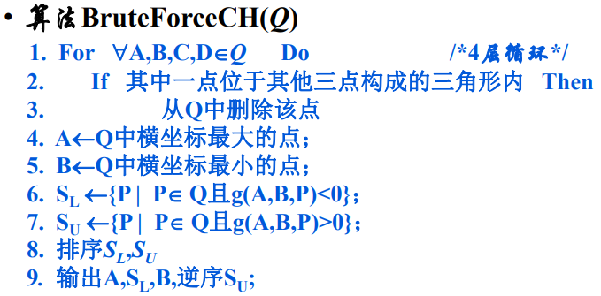
  算法需要四层循环，每层遍历所有点，复杂度为$O(n^4)$

* 实现如下，详见文件[BruteForceCH.hpp](lab01/BruteForceCH.hpp)

  ```c++
  /**
   * time complexity: O(n^4+nlog(n))
   */
  vector<Point<int>> BruteForceCH::work() {
      int n = P.size();
      if (n == 0) return vector<Point<int>>();
      for (int a = 0; a < n; ++a) {
          if (P[a].x < 0) continue; // Point::x < 0 -> point deleted
          for (int b = 0; b < n; ++b) {
              if (P[a].x < 0) break; // important
              if (b == a || P[b].x < 0) continue;
              for (int c = 0; c < n; ++c) {
                  if (P[b].x < 0 || P[a].x < 0) break; // important
                  if (c == a || c == b || P[c].x < 0) continue;
                  // check if abc on same line, if so, delete the middle point
                  if (P[a].cross(P[b], P[c]) == 0) {
                      int i = a, j = b, k = c;
                      if (P[j] < P[i]) swap(i, j);
                      if (P[j] < P[k]) P[j].x = -1;
                      else if (P[i] < P[k]) P[k].x = -1;
                      else P[i].x = -1;
                      continue;
                  }
                  for (int d = 0; d < n; ++d) {
                      if (d == a || d == b || d == c || P[d].x < 0) continue;
                      if (P[a].cross(P[b], P[c])*P[a].cross(P[b], P[d]) >= 0
                       && P[a].cross(P[c], P[b])*P[a].cross(P[c], P[d]) >= 0
                       && P[b].cross(P[c], P[a])*P[b].cross(P[c], P[d]) >= 0
                      ) {
                          P[d].x = -1; // delete
                      }
                  }
              }
          }
      }
      // A, B, left most & right most
      int m = 1, i = 0;
      while (P[i].x < 0) ++i;
      int a = i, b = i;
      for (++i; i < n; ++i) {
          if (P[i].x < 0) continue;
          ++m;
          if (P[i] < P[a]) a = i;
          if (P[b] < P[i]) b = i;
      }
      vector<Point<int>> CH(m), S_U(m);
      CH[0] = P[a]; // A
      int il = 1, iu = 0;
      // S_L, S_U
      for (int i = 0; i < n; ++i) {
          if (P[i].x < 0 || i == a || i == b) continue;
          if (P[a].cross(P[b], P[i]) < 0) { // < 0, S_L
              CH[il++] = P[i];
          } else { // > 0, S_U
              S_U[iu++] = P[i];
          }
      }
      // A, S_L, B, reverse(S_U)
      sort(CH.begin() + 1, CH.begin() + il); // S_L
      sort(S_U.begin(), S_U.begin() + iu);
      CH[il] = P[b]; // B
      for (int i = 0; i < iu; ++i) CH[il+1+i] = S_U[iu-1-i]; // reverse(S_U)
      return CH;
  }
  ```

  * 首先四层循环，不断删除点，如果这个点在某个三角形内的话，删除的点的$x$坐标标记为-1。
  * 需要注意和伪代码略有不同的是（伪代码只描述了主要逻辑，具体实现细节有的地方需要注意），三角形的三点如果共线，那么删除掉三点中中间的点，不进入4层循环，而是返回到删除点的那一层（向外可能多次break）
  * 最后就是图包点的顺序调整（和伪代码一致），返回

#### 实现基于Graham-Scan的凸包求解算法

* 算法思想

  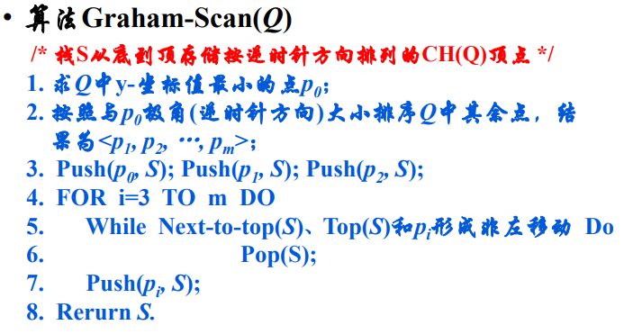

  算法需要用到排序，每个点最多访问两次（加入，删除），所以最终复杂度为$O(n\log n)$

* 实现如下，详见文件[GrahamScanCH.hpp](lab01/GrahamScanCH.hpp)

  ```c++
  /**
   * time complexity: O(nlog(n))
   */
  vector<Point<int>> GrahamScanCH::work() {
      int n = P.size();
      if (n == 0) return vector<Point<int>>();
      swap(P[0], *min_element(P.begin(), P.end()));
      if (n <= 2) return P;
      sort(P.begin()+1, P.end(), [&](const auto& a, const auto& b) {
          int c = P[0].cross(a, b);
          return c > 0 || (c == 0 && P[0].dist2(a) < P[0].dist2(b));
      });
      P.push_back(P[0]); // 处理最后一个点更简单
      vector<Point<int>> CH;
      int m = 0;
      for (int i = 0; i <= n; ++i) {
          while (m >= 2 && CH[m-2].cross(CH[m-1], P[i]) <= 0) {
              if (i == n && m == 2) break; // 防止所有点都共线，删除了一端端点
              CH.pop_back(), --m;
          }
          CH.push_back(P[i]);
          ++m;
      }
      CH.pop_back();
      return CH;
  }
  ```

  * 首先寻找左下角的点，按照它为极点将其余点按照极角排序（极角大小的判定通过叉积计算，比算角度方便）
  * 为了处理最后一个点方便，额外将极点再加入到末尾
    * 循环中注意所有点如果在同一条线上的话会多把一个端点删除掉，所以循环中有一行判断
  * 最后弹出额外加入的极点，返回凸包结果

#### 实现基于分治思想的凸包求解算法

* 算法思想

  * 实现了两种分治算法，分别见[DivAndConCH.hpp](lab01/DivAndConCH.hpp)和[DivAndConCH2.hpp](lab01/DivAndConCH2.hpp)

  * DivAndConCH2中的算法采用的是课件中的方式，主要在于merge步骤，前面部分都相同。

    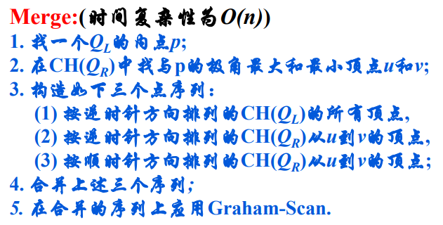

  * DivAndConCH中的算法采用的[Convex Hull: Divide and Conquer](http://web.ntnu.edu.tw/~algo/ConvexHull.html#6)方式，merge过程通过找上下公切线实现，从左凸包的最右点和右凸包的最左点开始，不断旋转端点到下一点，直到卡死，复杂度也是$O(n)$

    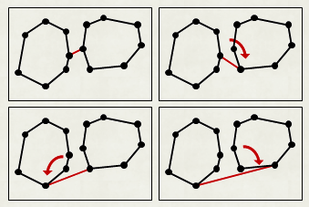

* 算法实现

  * DivAndConCH，找上下公切线方式merge

    ```c++
    /**
     * time complexity: O(nlog(n))
     */
    vector<Point<int>> DivAndConCH::work() {
        int n = P.size();
        if (n == 0) return vector<Point<int>>();
        sort(P.begin(), P.end());
        return _div_con(0, n);
    }
    
    vector<Point<int>> DivAndConCH::_div_con(int l, int r) {
        int m = r - l;
        if (m < 3) return vector<Point<int>>(P.begin()+l, P.begin()+r);
        vector<Point<int>> lCH = _div_con(l, l + m/2), rCH = _div_con(l + m/2, r);
        int lsz = lCH.size(), rsz = rCH.size();
        // merge
        int a = 0, b = 0;
        for (int i = 0; i < lsz; ++i) {
            if (lCH[a] < lCH[i]) a = i;
        }
        for (int i = 0; i < rsz; ++i) {
            if (rCH[i] < rCH[b]) b = i;
        }
        int llb = a, lrb = a, rlb = b, rrb = b;
        // 下公切线
        while (true) {
            bool changed = false;
            for (int nlrb = (lrb-1+lsz)%lsz, cs = rCH[rlb].cross(lCH[lrb], lCH[nlrb]);
                cs > 0 || (cs == 0 && rCH[rlb].dist2(lCH[lrb]) < rCH[rlb].dist2(lCH[nlrb]));
                nlrb = (lrb-1+lsz)%lsz, cs = rCH[rlb].cross(lCH[lrb], lCH[nlrb])) {
                    lrb = nlrb;
                    changed = true;
                }
            for (int nrlb = (rlb+1)%rsz, cs = lCH[lrb].cross(rCH[rlb], rCH[nrlb]);
                cs < 0 || (cs == 0 && lCH[lrb].dist2(rCH[rlb]) < lCH[lrb].dist2(rCH[nrlb]));
                nrlb = (rlb+1)%rsz, cs = lCH[lrb].cross(rCH[rlb], rCH[nrlb])) {
                    rlb = nrlb;
                    changed = true;
                }
            if (!changed) break;
        }
        // 上公切线
        while (true) {
            bool changed = false;
            for (int nllb = (llb+1)%lsz, cs = rCH[rrb].cross(lCH[llb], lCH[nllb]);
                cs < 0 || (cs == 0 && rCH[rrb].dist2(lCH[llb]) < rCH[rrb].dist2(lCH[nllb]));
                nllb = (llb+1)%lsz, cs = rCH[rrb].cross(lCH[llb], lCH[nllb])) {
                    llb = nllb;
                    changed = true;
                }
            for (int nrrb = (rrb-1+rsz)%rsz, cs = lCH[llb].cross(rCH[rrb], rCH[nrrb]);
                cs > 0 || (cs == 0 && lCH[llb].dist2(rCH[rrb]) < lCH[llb].dist2(rCH[nrrb]));
                nrrb = (rrb-1+rsz)%rsz, cs = lCH[llb].cross(rCH[rrb], rCH[nrrb])) {
                    rrb = nrrb;
                    changed = true;
                }
            if (!changed) break;
        }
        vector<Point<int>> CH;
        CH.push_back(lCH[llb]);
        while (llb != lrb) {
            llb = (llb+1)%lsz;
            CH.push_back(lCH[llb]);
        }
        CH.push_back(rCH[rlb]);
        while (rlb != rrb) {
            rlb = (rlb+1)%rsz;
            CH.push_back(rCH[rlb]);
        }
        return CH;
    }
    ```

    这里的merge步骤需要寻找上下的公切线，公切线是凸包上下的两条线（注意公切线端点不一定是两个凸包的最高最低点，需要通过旋转方向来判定--求叉积），得到公切线后逆时针保存凸包即可，merge步骤复杂度为$O(n)$，总的算法复杂度根据master定理可求得为$n\log n$

  * DivAndConCH2，课件中的方式，根据极角大小，逆时针方向merge

    ```c++
    /**
     * time complexity: O(nlog(n))
     */
    vector<Point<int>> DivAndConCH2::work() {
        int n = P.size();
        if (n == 0) return vector<Point<int>>();
        sort(P.begin(), P.end());
        return _div_con(0, n);
    }
    
    vector<Point<int>> DivAndConCH2::_div_con(int l, int r) {
        int m = r - l;
        if (m < 3) return vector<Point<int>>(P.begin()+l, P.begin()+r);
        vector<Point<int>> lCH = _div_con(l, l + m/2), rCH = _div_con(l + m/2, r);
        int lsz = lCH.size(), rsz = rCH.size();
        // merge
        vector<Point<int>> P2;
        P2.push_back(lCH[0]);
        auto cmp = [&](const auto& a, const auto& b) {
            int c = P2[0].cross(a, b);
            return c > 0 || (c == 0 && P2[0].dist2(a) < P2[0].dist2(b));
        };
        // 寻找右边极角最大，最小的点的下标，对应rh, rl
        int rl = 0, rh = 0;
        for (int i = 1; i < rsz; ++i) {
            if (cmp(rCH[rh], rCH[i])) rh = i;
            else if (cmp(rCH[i], rCH[rl])) rl = i;
        }
        // 将三个序列的元素归并到P2，复杂度O(n)
        int i = 1, j = rl, k = (rl - 1 + rsz) % rsz;
        while (i != lsz || j != rh || k != (rh-1+rsz)%rsz) {
            int flag = 0;
            if (i == lsz || (j != rh && cmp(rCH[j], lCH[i]))) flag = 1;
            if (flag == 1) {
                if (j == rh || (k != (rh-1+rsz)%rsz && cmp(rCH[k], rCH[j]))) flag = 2;
            } else if ((k != (rh-1+rsz)%rsz && cmp(rCH[k], lCH[i]))) {
                flag = 2;
            }
            if (flag == 0) {
                P2.push_back(lCH[i++]);
            } else if (flag == 1) {
                P2.push_back(rCH[j++]);
                j %= rsz;
            } else {
                P2.push_back(rCH[k--]);
                k = (k+rsz) % rsz;
            }
        }
        // P2中的点已经按照极角排序（逆时针排序），极点为P2[0]
        // 下面复用GrahamScanCH代码，已经有序，复杂度为O(n)
        int n = P2.size();
        P2.push_back(P2[0]);
        vector<Point<int>> CH;
        m = 0;
        for (int i = 0; i <= n; ++i) {
            while (m >= 2 && CH[m-2].cross(CH[m-1], P2[i]) <= 0) {
                if (i == n && m == 2) break; // 防止所有点都共线，删除了一端端点
                CH.pop_back(), --m;
            }
            CH.push_back(P2[i]);
            ++m;
        }
        CH.pop_back();
        return CH;
    }
    ```

    这里主要就是在左边凸包随意选择一点作为极点，然后寻找右边极角最大最小的两个点，这极角的比较也是通过判断旋转方向来的。然后知道坐标范围后归并三个序列，最后在这个序列上直接复用之前的GrahamScanCH代码（已经有序，不需要额外的排序预处理）。所以merge步骤复杂度为$O(n)$，总的算法复杂度根据master定理可求得为$n\log n$

### 对比三种凸包求解算法

#### 样本生成

[PointsSampler.hpp](lab01/PointsSampler.hpp)负责生成正方形(0,0)-(0,100)-(100,100)-(100,0)内的k个点，采用的算法是下面的水池抽样算法，参考[wiki: Reservoir sampling - An optimal algorithm](https://en.wikipedia.org/wiki/Reservoir_sampling#An_optimal_algorithm)，它将从正方形中等概率地生成k个点

```c++
class PointsSampler
{
public:
    const static int R = 101, C = 101, N = R * C;
    /**
     * Reservoir Sampling, time complexity O(k(1+log(n/k)))
     */
    static vector<Point<int>> sample_k(int k) {
        assert(k >= 0 && k <= N);
        vector<Point<int>> res;
        if (k == 0) return res;
        res.reserve(k);
        for (int i = 0; i < k; ++i) res.emplace_back(i/C, i%C);
        double W = exp(log(rand_real(0, 1))/k);
        for (int i = k; i < N;) {
            i += floor(log(rand_real(0, 1))/log(1-W)) + 1;
            if (i < N) {
                int idx = rand_int(0, k-1);
                res[idx].x = i/C;
                res[idx].y = i%C;
                W *= exp(log(rand_real(0, 1))/k);
            }
        }
        return res;
    }
};
```

算法复杂度为$O(k(1+log(n/k)))$，n为总的点数，所以这里就是$101\times 101 = 10201$，$k$是需要的点数

#### 运行结果对比

尝试随机生成了0到10000大小的样本（相邻样本大小间隔10），对四个凸包求解算法实现进行测试，然后用python的matplotlib进行绘图，得到如下结果


可以看出BruteForceCH的运行时间波动比较大，且运行时间随数据集增大增长更快，另外两种算法的运行时间随数据集增大增长比较平稳。也对应了他们各自的复杂度: BruteForceCH是$O(n^4)$, 另外三个是$nlog(n)$。两个分治算法运行时间基本相同，GrahamScan最优。主要分析是因为其只需要提前的一次排序，后面实际求图包过程是$O(n)$，而分治除了要预排序外，实际求解凸包的过程也是$O(n \log n)$，系数会更大，但都是同阶的$n \log n$。

### 参考

* [Convex Hull 演算法笔记](http://web.ntnu.edu.tw/~algo/ConvexHull.html)
* [wiki: 水池抽样算法](https://en.wikipedia.org/wiki/Reservoir_sampling)

## 实验二: 搜索算法

### 实验目的

* 掌握搜索算法的基本设计思想与方法
* 掌握A*算法的设计思想与方法
* 熟练使用高级编程语言实现搜索算法
* 利用实验测试给出的搜索算法的正确性

### 实验问题

寻路问题，给定网格，网格中有障碍，非障碍的格子可能带有额外代价，每一步可以去往相邻的8个格子，水平或垂直走代价为1，斜着走代价为`sqrt(2)`，寻找最小代价的路径。给定下面两个地图


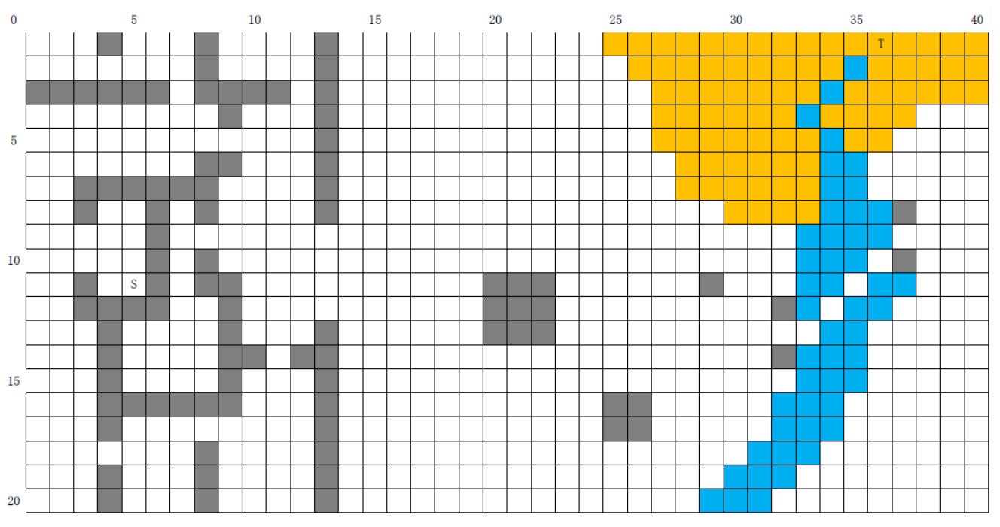

### 实验步骤

#### 单向A*算法

* 算法思想：采用Best-first策略搜索树，节点$n$的代价函数为$f(n)=g(n)+h(n)$，$g(n)$是从根到当前节点的代价，$h^*(n)$是从$n$到目标节点的优化路径代价，$h(n)$是$h^*(n)$的估计(必须满足$h(n)\le h^*(n)$)，这里采用的估计方式如下代码所示

  ```python
  def h(p1, p2):
      x1, y1 = p1
      x2, y2 = p2
      d = min(abs(x1 - x2), abs(y1 - y2))
      return math.sqrt(2)*d + abs(x1 - x2) + abs(y1 - y2) - 2*d
  ```

  即设当前点到目标点的x, y坐标差的绝对值为$dx, dy$，则$h(n)=\sqrt{2}\min(dx, dy)+|dx-dy|=\sqrt{2}\min(dx, dy)+dx+dy-2\min(dx, dy)$

* 算法核心实现如下

  ```python
  def astar(draw, grid, start, end):
      # count = 0
      open_set = []
      heapq.heappush(open_set, (0, start))
      came_from = {}
      g_score = {spot: float("inf") for row in grid for spot in row}
      g_score[start] = 0
      f_score = {spot: float("inf") for row in grid for spot in row}
      f_score[start] = h(start.get_pos(), end.get_pos())
  
      open_set_hash = {start}
  
      pause = 0
      while len(open_set):
          for event in pygame.event.get():
              if event.type == pygame.QUIT:
                  bye()
              elif event.type == pygame.KEYDOWN:
                  if event.key == pygame.K_SPACE:
                      pause ^= 1
                  elif event.key == pygame.K_q:
                      bye()
  
          if pause: continue
          current = heapq.heappop(open_set)[1]
          open_set_hash.remove(current)
  
          if current == end:
              reconstruct_path(came_from, end, draw)
              # end.make_end()
              return True
  
          for neighbor in current.neighbors:
              temp_g_score = g_score[current] + (1 if neighbor.row == current.row or neighbor.col == current.col else math.sqrt(2))
              if neighbor.cost_idx: temp_g_score += EXTRA_COST[neighbor.cost_idx]
              if temp_g_score < g_score[neighbor]:
                  came_from[neighbor] = current
                  g_score[neighbor] = temp_g_score
                  f_score[neighbor] = temp_g_score + h(neighbor.get_pos(), end.get_pos())
                  if neighbor not in open_set_hash:
                      # count += 1
                      heapq.heappush(open_set, (f_score[neighbor], neighbor))
                      open_set_hash.add(neighbor)
                      neighbor.make_open()
          
          draw()
  
          if current != start:
              current.make_closed()
  
      return False
  ```

  采用堆维护节点的代价，当遇到目标点时，构建最优路径，然后返回True
  
  构建最优路径比较简单，就是不断向上寻找父亲节点，代码如下
  
  ```python
  def reconstruct_path(came_from, current, draw):
      while current in came_from:
          current = came_from[current]
          current.make_path()
          draw()
  ```

#### 双向A*算法

* 和单向A*算法总体思想一致，只是现在从起始点和目标点同时开始搜索，当两端搜索的点相遇时，表示找到了最短路径，向两端构建最短路径

* 代码详情见[biastar.py](lab02/biastar.py)

  ```python
  def biastar(draw, grid, start, end):
      idx = 0
      open_set = [[], []]
      heapq.heappush(open_set[idx], (0, start))
      heapq.heappush(open_set[idx^1], (0, end))
      came_from = [{}, {}]
      g_score = [{spot: float("inf") for row in grid for spot in row}, {spot: float("inf") for row in grid for spot in row}]
      g_score[idx][start] = g_score[idx^1][end] = 0
      f_score = [{spot: float("inf") for row in grid for spot in row}, {spot: float("inf") for row in grid for spot in row}]
      f_score[idx][start] = f_score[idx^1][end] = h(start.get_pos(), end.get_pos())
  
      open_set_hash = [{start}, {end}]
  
      pause = 0
      while len(open_set[0]) and len(open_set[1]):
          for event in pygame.event.get():
              if event.type == pygame.QUIT:
                  bye()
              elif event.type == pygame.KEYDOWN:
                  if event.key == pygame.K_SPACE:
                      pause ^= 1
                  elif event.key == pygame.K_q:
                      bye()
          if pause: continue
          if len(open_set[idx]) > len(open_set[idx^1]): idx ^= 1
          current = heapq.heappop(open_set[idx])[1]
          open_set_hash[idx].remove(current)
  
          if current in open_set_hash[idx^1]:
              print(current.row, current.col)
              reconstruct_path(came_from[0], current, draw)
              reconstruct_path(came_from[1], current, draw)
              # end.make_end()
              return True
  
          for neighbor in current.neighbors:
              temp_g_score = g_score[idx][current] + (1 if neighbor.row == current.row or neighbor.col == current.col else math.sqrt(2))
              if neighbor.cost_idx: temp_g_score += EXTRA_COST[neighbor.cost_idx]
              if temp_g_score < g_score[idx][neighbor]:
                  came_from[idx][neighbor] = current
                  g_score[idx][neighbor] = temp_g_score
                  f_score[idx][neighbor] = temp_g_score + h(neighbor.get_pos(), end.get_pos())
                  if neighbor not in open_set_hash[idx]:
                      heapq.heappush(open_set[idx], (f_score[idx][neighbor], neighbor))
                      open_set_hash[idx].add(neighbor)
                      neighbor.make_open()
          
          draw()
  
          if current != start and current != end:
              current.make_closed()
  
      return False
  ```

#### 图形化，用户交互

* 为了便于展示与用户交互，采用pygame（一个python的游戏开发库）进行开发

  * 可视化代码借鉴 [ytb: A* Pathfinding Visualization Tutorial](https://www.youtube.com/watch?v=JtiK0DOeI4A)

* 使用说明

  两个程序`astar.py`和`biastar.py`分别对应了单向和双向的`A*`搜索，程序的使用方法完全一致

  * `pip install pygame` 安装依赖pygame

  * `python astar.py [mapfile.txt]`

  * 这里的地图文件可以通过按`s`键保存得到，参考下面的COMMANDS

  * 实验中要求的两个地图我已经保存了，对应`map1.txt`和`map2.txt`: `python astar.py map1.txt`运行

* COMMANDS 操作方式

  * 鼠标左键 设置某个块儿
* 默认情况或者按了`0`之后，左键会把点击的块儿设置为**起点**（不存在起点），**终点**（存在起点不存在终点），**障碍**（已存在起点和终点）
  * 按了`1`之后，为点击的块儿设置额外代价（经过这个块儿会有额外代价）
  * 按了`2`之后同理，只是额外代价不同
  * 额外的代价见代码中的变量: `EXTRA_COST = [0, 2, 4]`，如果还想有更多的代价往后面加就行了，因为采用一个数字按键对应不同代价，所以最多可以有9种额外代价，对应按键/下标: `1-9`.
  * 鼠标右键 清除某个块儿
  * 键盘`q` 退出程序
  * 键盘`s` 保存当前地图到当前目录，按时间命名（详细说明见下一节）
  * 键盘`<SPACE>` 开始/暂停/继续路径搜索
  * 键盘`c` 清除搜索痕迹(搜索过程中不可用)
  * 键盘`n` 清空地图(搜索过程中不可用)

#### 地图保存，加载

程序实现了地图的保存与加载：

* 按键盘的`s`键保存地图
* `python astar.py map01.txt`加载地图`map01.txt`运行

下面对地图文件的格式做说明，比如对于第二个地图`map02.txt`

```txt
20 40 34
0 0 0 -1 0 0 0 -1 0 0 0 0 -1 0 0 0 0 0 0 0 0 0 0 0 2 2 2 2 2 2 2 2 2 2 2 T2 2 2 2 2 
0 0 0 0 0 0 0 -1 0 0 0 0 -1 0 0 0 0 0 0 0 0 0 0 0 0 2 2 2 2 2 2 2 2 2 1 2 2 2 2 2 
-1 -1 -1 -1 -1 -1 0 -1 -1 -1 -1 0 -1 0 0 0 0 0 0 0 0 0 0 0 0 0 2 2 2 2 2 2 2 1 2 2 2 2 2 2 
0 0 0 0 0 0 0 0 -1 0 0 0 -1 0 0 0 0 0 0 0 0 0 0 0 0 0 2 2 2 2 2 2 1 2 2 2 2 0 0 0 
0 0 0 0 0 0 0 0 0 0 0 0 -1 0 0 0 0 0 0 0 0 0 0 0 0 0 2 2 2 2 2 2 2 1 2 2 0 0 0 0 
0 0 0 0 0 0 0 -1 -1 0 0 0 -1 0 0 0 0 0 0 0 0 0 0 0 0 0 0 2 2 2 2 2 2 1 1 0 0 0 0 0 
0 0 -1 -1 -1 -1 -1 -1 0 0 0 0 -1 0 0 0 0 0 0 0 0 0 0 0 0 0 0 2 2 2 2 2 2 1 1 0 0 0 0 0 
0 0 -1 0 0 -1 0 -1 0 0 0 0 -1 0 0 0 0 0 0 0 0 0 0 0 0 0 0 0 0 2 2 2 2 1 1 1 -1 0 0 0 
0 0 0 0 0 -1 0 0 0 0 0 0 0 0 0 0 0 0 0 0 0 0 0 0 0 0 0 0 0 0 0 0 1 1 1 1 0 0 0 0 
0 0 0 0 0 -1 0 -1 0 0 0 0 0 0 0 0 0 0 0 0 0 0 0 0 0 0 0 0 0 0 0 0 1 1 1 0 -1 0 0 0 
0 0 -1 0 S0 -1 0 -1 -1 0 0 0 0 0 0 0 0 0 0 -1 -1 -1 0 0 0 0 0 0 -1 0 0 0 1 1 0 1 1 0 0 0 
0 0 -1 -1 -1 -1 0 0 -1 0 0 0 0 0 0 0 0 0 0 -1 -1 -1 0 0 0 0 0 0 0 0 0 -1 1 0 1 1 0 0 0 0 
0 0 0 -1 0 0 0 0 -1 0 0 0 -1 0 0 0 0 0 0 -1 -1 -1 0 0 0 0 0 0 0 0 0 0 0 1 1 0 0 0 0 0 
0 0 0 -1 0 0 0 0 -1 -1 0 -1 -1 0 0 0 0 0 0 0 0 0 0 0 0 0 0 0 0 0 0 -1 1 1 1 0 0 0 0 0 
0 0 0 -1 0 0 0 0 -1 0 0 0 -1 0 0 0 0 0 0 0 0 0 0 0 0 0 0 0 0 0 0 0 1 1 1 0 0 0 0 0 
0 0 0 -1 -1 -1 -1 -1 -1 0 0 0 -1 0 0 0 0 0 0 0 0 0 0 0 -1 -1 0 0 0 0 0 1 1 1 0 0 0 0 0 0 
0 0 0 -1 0 0 0 0 0 0 0 0 -1 0 0 0 0 0 0 0 0 0 0 0 -1 -1 0 0 0 0 0 1 1 1 0 0 0 0 0 0 
0 0 0 0 0 0 0 -1 0 0 0 0 -1 0 0 0 0 0 0 0 0 0 0 0 0 0 0 0 0 0 1 1 1 0 0 0 0 0 0 0 
0 0 0 -1 0 0 0 -1 0 0 0 0 -1 0 0 0 0 0 0 0 0 0 0 0 0 0 0 0 0 1 1 1 0 0 0 0 0 0 0 0 
0 0 0 -1 0 0 0 -1 0 0 0 0 -1 0 0 0 0 0 0 0 0 0 0 0 0 0 0 0 1 1 1 0 0 0 0 0 0 0 0 0 
```

第一行三个整数`m,n,gap`分别表示地图格子有`m`行，`n`列，每个格子都是`gap*gap`像素大小的正方形块儿

接下来的m行n列整数具体代表了地图信息，一共有三种格子：

* `-1`表示障碍

* `0`表示可以行走的块，并且没有额外代价

* `1-9`代表了可以行走的块，但是具有额外代价，这个数字代表了额外代价的下标，比如程序中的额外代价定义如下，表示下标1对应代价为2，下标2对应代价为4

  ```python
  # LAND, RIVER, DESERT
  EXTRA_COST = [0, 2, 4]
  ```

### 实验结果

* 单向`A*`，使用`map01.txt`

  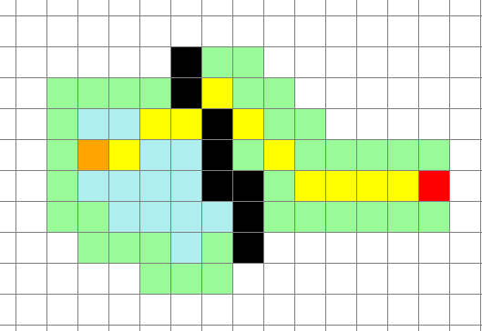

* 双向`A*`，使用`map01.txt`

  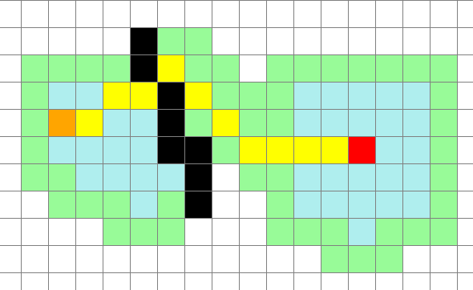

* 单向`A*`，使用`map02.txt`

  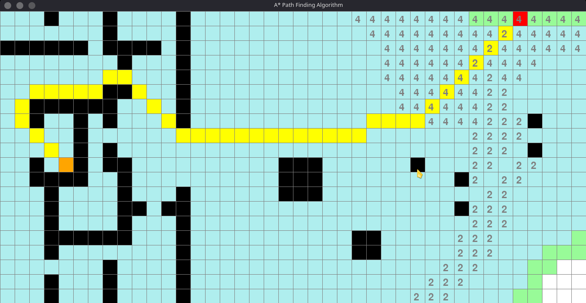

* 双向`A*`，使用`map02.txt`

  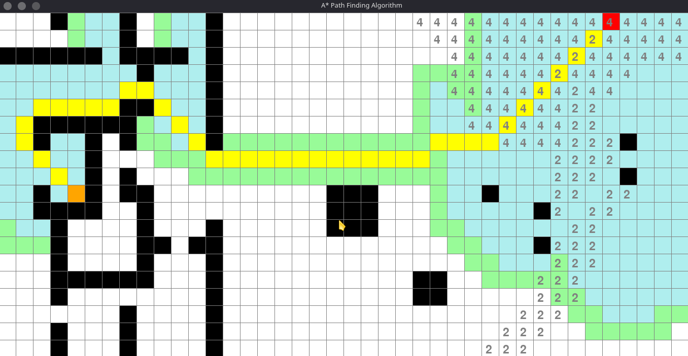

可以看出双向A\*在地图比较复杂时可以很好地减少搜索的节点数目（比如对于这里的地图2），因为它在选择扩展哪一端的搜索节点的时候总是选择当前openset小的那一端。而单向的A\*则几乎搜完了整个地图。

## 实验三: 近似算法

### 实验目的

* 掌握近似算法的基本设计思想与方法
* 掌握集合覆盖问题近似算法的设计思想与方法
* 熟练使用高级编程语言实现近似算法
* 利用实验测试给出不同近似算法的性能以理解其优缺点。

### 实验问题

求解集合覆盖问题

* 输入: 有限集$X$，$X$的子集合族$F$，$X=\cup_{S \in F}S$
* 输出: $C \subseteq F$，满足
  * $X = \cup_{S \in C}S$
  * $C$是满足上一条件的最小集族, 即$|C|$最小.

### 实验步骤

#### 实现基于贪心策略的近似算法

* 算法思想

  

  而对于本实验，集合的代价都一样，都是1，所以上面的代码等价于

  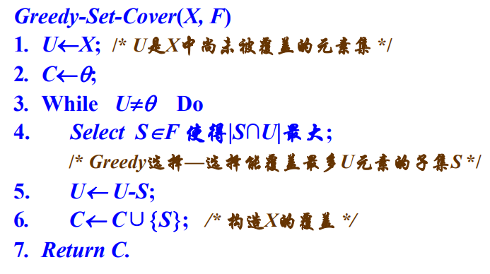

* 代码实现，见[GreedySetCover.hpp](lab03/GreedySetCover.hpp)

  ```c++
  vector<int> greedy_set_cover(vector<vector<int>> &F, vector<int> &U) {
      int n = F.size();
      unordered_set<int> C; // 已经包含的集合，这里每个集合用它的下标表示
      unordered_set<int> Us(U.begin(), U.end()); // 还剩下的元素
      vector<int> res; // 返回集合的下标
      while (!Us.empty()) {
          int sz = 0, j = -1; // 这次新包含F[j]可以新加入sz个元素
          for (int i = 0; i < n; ++i) {
              if (C.count(i)) continue; // 已经包含了
              int cur_sz = 0;
              for (int x: F[i]) {
                  if (Us.count(x)) ++cur_sz;
              }
              if (cur_sz > sz) j = i;
          }
          for (int x: F[j]) Us.erase(x);
          res.push_back(j);
          C.insert(j);
      }
      return res;
  }
  ```

#### 实现一个基于线性规划近似算法

* 算法思想

  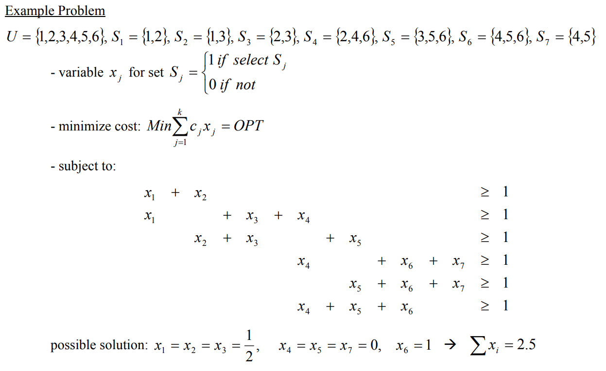

  * 将集合覆盖问题转换为线性规划问题（将对$x$的约束从$\{0,1\}$松弛为$x\ge 0$），然后采用工具求解线性规划问题，

  * 之后再根据舍入法或者随机舍入法获得原问题的解

  * 舍入法思想

    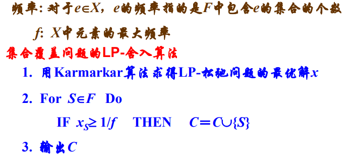

* 代码实现，这里借助GLPK库求解线性规划问题，并采用舍入法转为原来问题的解，详见[LPRoundingSetCover.hpp](lab03/LPRoundingSetCover.hpp)

  ```c++
  vector<int> LP_rounding_set_cover(vector<vector<int>> &F, vector<int> &U) {
      int n = F.size(); // x个数
      int m = U.size(); // 约束不等式个数
      unordered_map<int, int> x2i;
      for (int i = 0; i < m; ++i) x2i.emplace(U[i], i); // 每个元素对应的下标（对应了m个不等式约束）
      glp_prob *lp = glp_create_prob();
      glp_set_obj_dir(lp, GLP_MIN); // 最小化目标（设置优化方向）
      glp_add_rows(lp, m); // 不等式个数
      for (int i = 1; i <= m; ++i) glp_set_row_bnds(lp, i, GLP_LO, 1., 0.); // 都是 >= 1
      glp_add_cols(lp, n); // 变量x个数
      for (int i = 1; i <= n; ++i) {
          glp_set_col_bnds(lp, i, GLP_LO, 0., 0.); // x的约束都是 >= 0
          glp_set_obj_coef(lp, i, 1.); // 目标函数中的x的系数，都是1
      }
      // f是最高的元素频率
      int sz = 0;
      vector<int> freq(m);
      for (auto &S: F) {
          sz += S.size();
          for (int x: S) ++freq[x2i[x]];
      }
      int f = *max_element(freq.begin(), freq.end());
      int *ia = new int[sz+1];
      int *ja = new int[sz+1];
      double *ar = new double[sz+1];
      int idx = 1;
      for (int i = 0; i < n; ++i) {
          for (int x: F[i]) {
              ia[idx] = x2i[x] + 1;
              ja[idx] = i + 1;
              ar[idx] = 1.;
              ++idx;
          }
      }
      glp_load_matrix(lp, sz, ia, ja, ar);
      // glp_write_mps，glp_read_mps也可以写读lp问题，但这里对于现生成的数据不用了
      // lp问题初始化完毕，开始求解
      glp_smcp smcp;
      glp_init_smcp(&smcp);
      // 默认GLP_MSG_ALL: full output (including informational messages).
      smcp.msg_lev = GLP_MSG_ERR; // error and warning messages only; 
      smcp.msg_lev = GLP_MSG_ON; // error and warning messages only; 
      // smcp.presolve = GLP_ON;
      glp_simplex(lp, &smcp);
      // glp_iptcp iptcp;
      // iptcp.msg_lev = GLP_MSG_ERR;
      // glp_interior(lp, &iptcp);
  
      // glp_simplex(lp, nullptr); // 单纯形法求，发现更快
      // glp_interior(lp, nullptr); // 内点法求（karmarkar）
  
      // 舍入法选择保留的集合
      vector<int> res; // 返回集合的下标
      for (int i = 0; i < n; ++i) {
          if (1./f <= glp_get_col_prim(lp, i+1)) res.push_back(i);
          // cout << "x" << i << ": " << glp_get_col_prim(lp, i) << " ";
      }
      // cout << endl;
      delete [] ia;
      delete [] ja;
      delete [] ar;
      glp_delete_prob(lp);
      return res;
  }
  ```

#### 测试算法性能

* 数据生成方式

  为了方便，实验把全集定为0到N-1，按照指导书的方式生成一些集合保证有解，然后再随机生成剩余的集合，每个集合大小还是在1到20之间，集合元素从所有元素中随机取，这里的实现也使用了水池抽样算法，具体代码见[Sampler.hpp](lab03/Sampler.hpp)

* 实现代码

    ```c++
    /**
     * 集族 F
     * [0..N-1]
     */
    vector<vector<int>> generate_subsets(int N) {
        assert(N >= 20);
        vector<vector<int>> F;
        int sz = 0;
        unordered_set<int> U; // 剩下的
        // [0..N-1]
        for (int i = 0; i < N; ++i) U.insert(i);
        unordered_set<int> C; // 已经包含的
        F.emplace_back(sample_k(20, N));
        for (int x: F[0]) {
            U.erase(x);
            C.insert(x);
        }
        ++sz;
        while (!U.empty()) {
            if (U.size() < 20) {
                F.emplace_back(U.begin(), U.end());
                ++sz;
                break;
            }
            int n = rand_int(1, 20);
            int k = rand_int(1, n); // 新元素个数
            F.emplace_back(sample_k(k, U));
            vector<int> old = sample_k(k, C);
            for (int x: F[sz]) {
                U.erase(x);
                C.insert(x);
            }
            F[sz].insert(F[sz].end(), old.begin(), old.end());
            ++sz;
        }
        while (sz != N) {
            F.push_back(sample_k(rand_int(1, 20), N));
            ++sz;
        }
        return F;
    }
    ```

### 试验结果

分别对$|X|=|F|=100,1000,5000$ 三种情况进行了测试，记录了问题求解的时间并验证了求解的$C$是否覆盖了所有元素

某次运行结果如下所示，这里保留了GLPK的迭代信息输出

```txt
----N: 100
took: 0.001194 second(s)
size of C: 23
valid cover: true
----N: 1000
took: 0.126470 second(s)
size of C: 274
valid cover: true
----N: 5000
took: 2.972539 second(s)
size of C: 1324
valid cover: true
----------------------
----N: 100
      0: obj =   0.000000000e+00 inf =   1.000e+02 (100)
     13: obj =   1.100000000e+01 inf =   0.000e+00 (0)
*    85: obj =   7.481971581e+00 inf =   0.000e+00 (0)
took: 0.005796 second(s)
size of C: 25
valid cover: true
----N: 1000
      0: obj =   0.000000000e+00 inf =   1.000e+03 (1000)
    157: obj =   1.183333333e+02 inf =   1.332e-15 (0)
*  1652: obj =   8.194573952e+01 inf =   0.000e+00 (0) 15
took: 0.232819 second(s)
size of C: 321
valid cover: true
----N: 5000
      0: obj =   0.000000000e+00 inf =   5.000e+03 (5000)
    703: obj =   5.870000000e+02 inf =   0.000e+00 (0) 2
*  5982: obj =   4.527092380e+02 inf =   0.000e+00 (2273) 52
*  8251: obj =   4.301339718e+02 inf =   0.000e+00 (2282) 23
*  9979: obj =   4.174880525e+02 inf =   0.000e+00 (2140) 17
* 11587: obj =   4.094090563e+02 inf =   0.000e+00 (2178) 15
* 13031: obj =   4.046629836e+02 inf =   0.000e+00 (2301) 15
* 14449: obj =   4.013014280e+02 inf =   0.000e+00 (2211) 14
* 15868: obj =   3.993408117e+02 inf =   0.000e+00 (1784) 13
* 17296: obj =   3.986827901e+02 inf =   0.000e+00 (64) 15
* 17355: obj =   3.986823266e+02 inf =   0.000e+00 (0)
took: 40.719696 second(s)
size of C: 1679
valid cover: true
----------------------
```

上面三个是对第一个贪心求解方法的测试，下面三个是利用舍入法进行的求解，可以看出基于贪心的求解比较快，最终求解的覆盖集合$C$的大小两个方法相差不大，不过还是基于贪心策略的方法要小一些，可能是由于矩阵比较大，解起来花费时间较多。验证了两种方法在三个不同大小的数据集上都得到了有效的集合覆盖。

## 实验四: 快速排序

### 实验目的

* 掌握快速排序随机算法的设计思想与方法
* 熟练使用高级编程语言实现不同的快速排序算法
* 利用实验测试给出不同快速排序算法的性能以理解其优缺点

### 实验问题

快速排序是算法导论中的经典算法。在本实验中，给定一个长为n的整数数组，要求将数组升序排序。

### 实验步骤

#### 按照算法导论中给出的伪代码实现快速排序

根据伪代码实现的快排如下，见文件[qsort.hpp](lab04/qsort.hpp)

```c++
void qsort01(vector<int>& A, int l, int r) {
    if (l >= r) return;
    int i = rand_int(l, r);
    swap(A[r], A[i]);
    i = l - 1;
    for (int j = l; j < r; ++j) {
        if (A[j] <= A[r]) swap(A[++i], A[j]);
    }
    swap(A[++i], A[r]);
    qsort01(A, l, i - 1);
    qsort01(A, i + 1, r);
}
```

#### 使用三路划分进行改进

上面实现比较明显的弊端就是，虽然采用了随机的划分点，但是对于重复元素多的情况，仍然可能导致每次的划分很不均匀，进而导致复杂度退化到$O(n^2)$的情况

对此可以采用三路划分进行改进，每次不是将数据划分为小于和大于等于两个部分，而是划分为小于，等于，大于三个部分，对于重复元素多的情况复杂度甚至会降低，提升到$O(n)$

算法实现如下，见文件[qsort.hpp](lab04/qsort.hpp)

```c++
/**
 * use three way partition
 * T(n) = 2T(n/2) + n
*/
void qsort02(vector<int>& A, int l, int r) {
    if (l >= r) return;
    int i = rand_int(l, r);
    int x = A[i], lo = l, hi = r;
    i = l;
    while (i <= hi) {
        if (A[i] == x) ++i;
        else if (A[i] < x) swap(A[i++], A[lo++]);
        else swap(A[i], A[hi--]);
    }
    // ----[x]xx[x]++++
    //     lo   hi
    qsort02(A, l, lo - 1);
    qsort02(A, hi + 1, r);
}
```

#### 测试算法在不同输入下的表现

测试了N为10K，100K，1000K下的运行时间数据，可以使用`python draw.py`进行绘图（这里N为1000k的时候第一种快排实现运行过慢，没有包含它），`std::sort`为C++的标准库的sort

* 绘图如下
  * `N=10k`

    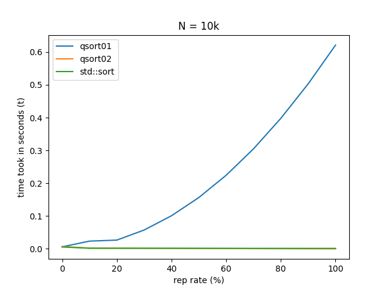

  * `N=100k`

    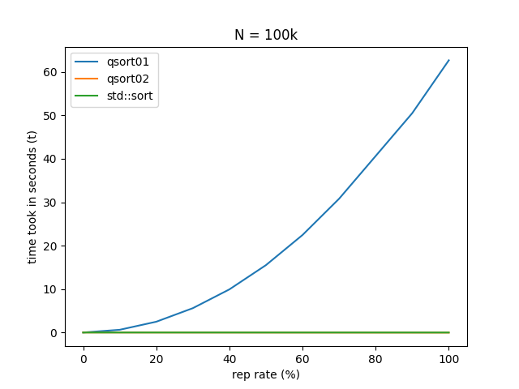

  * `N=1000k`

    

### 结果分析

* 可以看出当元素重复率逐渐增高时，第一种快排实现运行时间上升非常快（是由于在partition时，分得不均匀，一侧可能只有一个或几个元素，时间复杂度降为O(n^2)）
* 而系统的快排实现中规中矩，运行时间比较稳定，因为它并不是单纯的快排实现，而是几种排序方法的混合体，叫做introsort
  * 它开始于快排
  * 如果递归层数过深会改用heapsort
  * 当数据量小于某个阈值改为插入排序
  * 采用三数取中划分（Median-of-3 partition）
* 采用三路划分优化的快排对于重复元素的优化特别好，重复率越高，复杂度越趋于`O(n)`

## 实验五: 计算k位数的随机算法

### 实验目的

* 掌握分治算法和随机算法的设计思想与方法
* 熟练使用高级编程语言实现分治算法和随机算法
* 通过对比不同参数，理解算法具体原理，理解分治算法和随机算法。

### 实验问题

输入：乱序实数数组$A=\{x_1,x_2,...,x_n\}$

输出：$A$的第$k$小元素（详情请见课件分治算法、随机算法）

### 实验步骤

#### 实现基于分治方法的k位数算法

* 算法思想

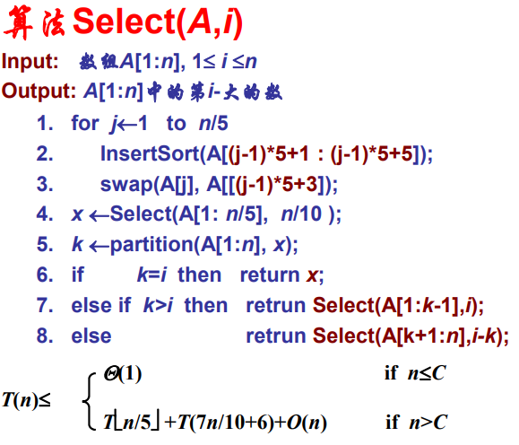

​	把数据以5个一组，每次选取它们的中位数的中位数作为pivot值进行划分

* 算法复杂度为$O(n)$，证明如下

  * 假设$T(n)=tn$
    $$
    \begin{align*}
    T(n) =tn&\le tn/5 + 7tn/10 + an \\
    	 &= tn - tn/10 + an
    \end{align*}
    \Rightarrow t \le 10a
    $$

  * 所以只需要令$t \le 10a$即可，所以算法复杂度为$O(n)$

* 算法实现

  ```c++
  int pick(vector<int> &L, int l, int r, int k) {
    if (l == r) return L[l];
  
    // get median of medians
    for (int i = l; i <= r; i += 5) {
      int j = min(r, i + 5);
      for (int ii = i + 1; ii <= j; ++ii) {
        for (; ii > i && L[ii - 1] > L[ii]; --ii) swap(L[ii], L[ii - 1]);
      }
      swap(L[l + (i - l) / 5], L[(i + j) / 2]);
    }
    int nr = l + (r - l) / 5;
    int median = pick(L, l, nr, (nr + l) / 2);
  
    // three way partition with the approximate median
    // ---[=]=[=]+++
    //    low high
    int i = l, low = l, high = r;
    while (i <= high) {
      if (L[i] == median)
        ++i;
      else if (L[i] < median)
        swap(L[i++], L[low++]);
      else
        swap(L[i], L[high--]);
    }
  
    if (k < low) {
      return pick(L, l, low - 1, k);
    } else if (k <= high) {
      return L[k];
    } else {
      return pick(L, high + 1, r, k);
    }
  }
  ```

#### 实现基于随机方法的k位数算法

* 算法原理

  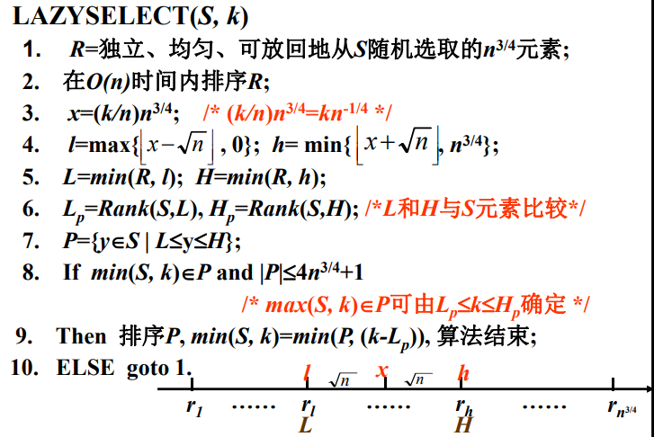

* 算法实现

  ```c++
  /**
   * n = A.size()
   * k in [0..n-1]
   */
  int lazyselect(const vector<int> &A, int k) {
      int n = A.size(), m = pow(n, 3./4); // size of A, R
      int x = k*pow(n, -1./4), l = max(int(x-sqrt(n)), 0), h = min(int(x+sqrt(n)), m-1);
      int loops = 0;
      while (1) {
          ++loops;
          // cout << "loop: " << ++loops << endl;
          vector<int> R = sample_k(A, m);
          sort(R.begin(), R.end());
          int L = R[l], H = R[h];
          int cnt = 0; // count number of elements that are smaller than L in A
          vector<int> P;
          for (int i = 0; i < n; ++i) {
              if (A[i] < L) ++cnt;
              else if (A[i] <= H) P.push_back(A[i]);
          }
          int sz = P.size();
          if (k >= cnt && k < cnt + sz && sz <= 4*m+1) {
              sort(P.begin(), P.end());
              return P[k-cnt];
          }
      }
  }
  ```

#### 对比两种k位数算法

采用不同大小的随机序列进行测试，每个序列运行1000次取运行时间的平均值，结果如下

```txt
(N=1000)        lazyselect:     0.000148354
(N=1000)        BFPRT     :     0.000172629
(N=2000)        lazyselect:     0.000245446
(N=2000)        BFPRT     :     0.000349101
(N=5000)        lazyselect:     0.000543804
(N=5000)        BFPRT     :     0.000897497
(N=10000)       lazyselect:     0.000987361
(N=10000)       BFPRT     :     0.00176972
(N=20000)       lazyselect:     0.00178929
(N=20000)       BFPRT     :     0.00353356
(N=50000)       lazyselect:     0.0039252
(N=50000)       BFPRT     :     0.009168
(N=100000)      lazyselect:     0.0070601
(N=100000)      BFPRT     :     0.018703
```

可以看出二者运行时间均随N的增大而线性增加，BFPRT略慢于lazyselect，主要是因为BFPRT的常数项比较大，而lazyselect有可能一轮就找到正确答案。

#### 随机算法参数分析

TODO 暂未实现