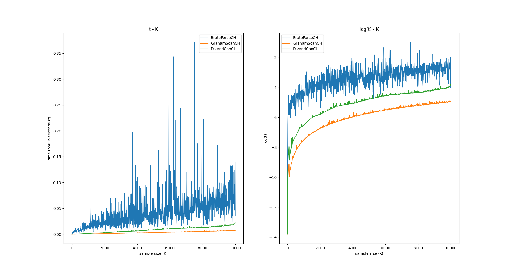

# 实验一: 分治算法

* 实现了水池抽样用来随机生成大小为k的样本点
* 实现了三种凸包算法: 基于枚举方法(BruteForce), Graham-Scan算法, 分治算法(Divide and Conquer) -- (两种归并方法)
* 记录不同算法在不同规模数据集上求解凸包的时间，并绘制算法性能曲线

## 文件说明

* `Point.hpp` 中定义了点类，包含了点的x，y坐标以及坐标间的一些运算
* `PointSampler.hpp` 中的`vector<Point<int>> PointSampler::sample_k(int k)`用于从正方形`(0,0)-(0,100)-(100,100)-(100,0)`内的点中随机取k个点。采用了水池抽样算法，比较高效，复杂度`O(k(1+log(n/k)))`
* `BruteForceCH.hpp` `GrahamScanCH.hpp` `DivAndConCH.hpp` 分别对应的三种凸包算法的实现，他们共同继承自`ConvexHull.hpp`
* `main.cpp` 负责在生成的不同大小数据集上调用凸包函数，并记录凸包求解时间
* `Makefile` 使用`make`进行编译，`make clean`清除编译的文件

## 程序编译与运行

* 使用`make`进行编译
* `./main > data.txt`运行，针对三个凸包算法，在`0, 10, 20, ... 10000`个点上求凸包，记录每次求解时间
  * 输出格式每个数据集合一行: `数据集大小(样本点个数k) BruteForceCH时间 GrahamScanCH时间 DivAndConCH时间`
  * 输出重定向到`data.txt`是为了下一步使用python绘图时读取这个数据

### 绘图

* 需要安装`matplotlib`和`numpy`
* 运行`python draw.py [datafile]`即会读取上面生成的`data.txt`进行绘图
  
* 可以看出BruteForceCH的运行时间波动比较大，且运行时间随数据集增大增长更快，另外两种算法的运行时间随数据集增大增长比较平稳。也对应了他们各自的复杂度: BruteForceCH是`O(n^4)`, 另外两个是`nlog(n)`.
* 在修复BruteForceCH中的bug之后([commit: fix bug in BruteForceCH](https://github.com/sky-bro/HIT-Algo/commit/c8d9082a97aba99b796b51aed4c9f525d0f53115))，因为如果外层循环的点被标记了删除，那么内层循环会break到上一层，所以实际的复杂度很难达到`n^4`，所以新的时间-样本大小的绘图如下
  

## Refs

* [Convex Hull 演算法笔记](http://web.ntnu.edu.tw/~algo/ConvexHull.html) 包含各种求解凸包问题的算法
  * 我实现的分治算法[DivAndConCH.hpp](./DivAndConCH.hpp)是参考的这里的[Convex Hull: Divide and Conquer](http://web.ntnu.edu.tw/~algo/ConvexHull.html#6) 和课件中的比较一致，这里归并采用的是找上下切线，~~课件里面的归并步骤我没看懂。~~网上好多用quick hull也是属于分治，不过和课件的分治区别较大
  * 也已实现课件里的分治，见[DivAndConCH2.hpp](./DivAndConCH2.hpp)
* [Reservoir Sampling: An optimal algorithm](https://en.wikipedia.org/wiki/Reservoir_sampling#An_optimal_algorithm) 水池抽样算法参考
